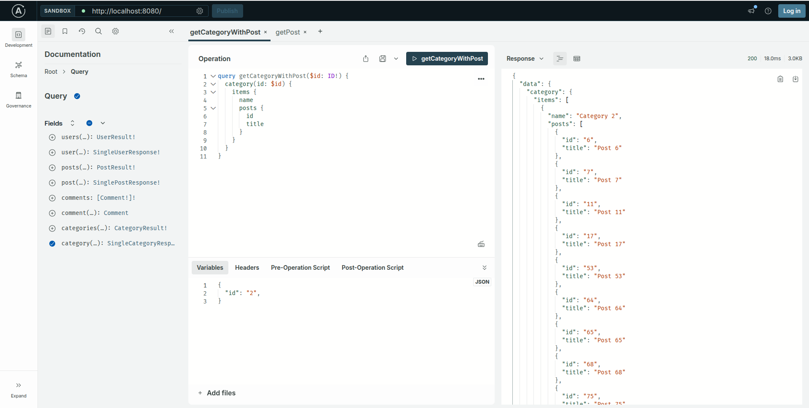
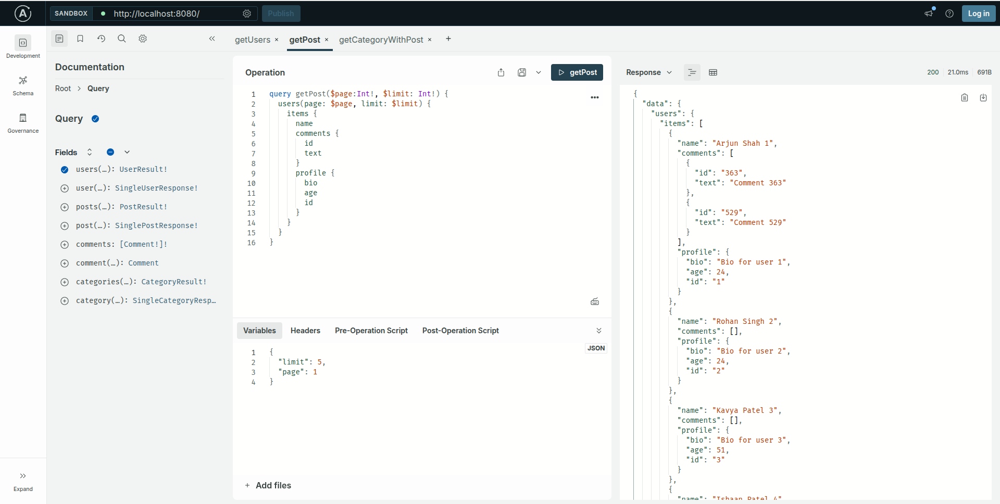

# Node GraphQL Example

This project demonstrates a modular GraphQL API built with Apollo Server in Node.js.  
It features a clean architecture with separate folders for schema, resolvers, and mock/test data.  
You can run the server, explore the API, and execute automated tests with mocked data.

---

## Features

- Modular GraphQL type definitions (`typeDefs`) and resolvers
- Pagination and total count for queries
- Mocked data for easy testing
- ES module support
- Automated tests using Jest
- Alias support for imports
- Example queries for categories and posts

---

## Project Structure

```
src/
  ├── data/                # Mock data files
  ├── schema/
  │     ├── resolvers/     # GraphQL resolvers
  │     ├── typeDefs/      # GraphQL type definitions
  │     ├── index.js       # Combines typeDefs and resolvers
  ├── index.js             # Apollo Server entry point
tests/
  ├── post.resolver.test.js
  ├── category.resolver.test.js
  ├── typeDefs.test.js
assets/
  ├── screenshots/
      ├── playground.png
      ├── test-results.png
```

---

## Screenshots

### GraphQL Playground





---

## Getting Started

### 1. Install Dependencies

```sh
npm install
```

### 2. Start the Server

```sh
npm start
```

The server will run at [http://localhost:8080](http://localhost:8080).  
Open GraphQL Playground or Apollo Studio to explore the API.

---

## Running Tests

Automated tests use mocked data and check resolver logic and schema validity.

```sh
npm test
```

Test results will be shown in your terminal.  

---

## Example Queries

**Get paginated posts:**
```graphql
query {
  posts(limit: 2, page: 1) {
    total
    items { id title }
  }
}
```

**Get categories with posts:**
```graphql
query {
  categories(limit: 2, page: 1) {
    items { id name posts { id title } }
    total
    hasNext
  }
}
```

---

## Notes

- All test cases use mocked data for isolation and reliability.
- Type definitions are modular and use `extend type Query` for scalability.
- For custom import aliases, see `jest.config.js`.

---

## License

MIT